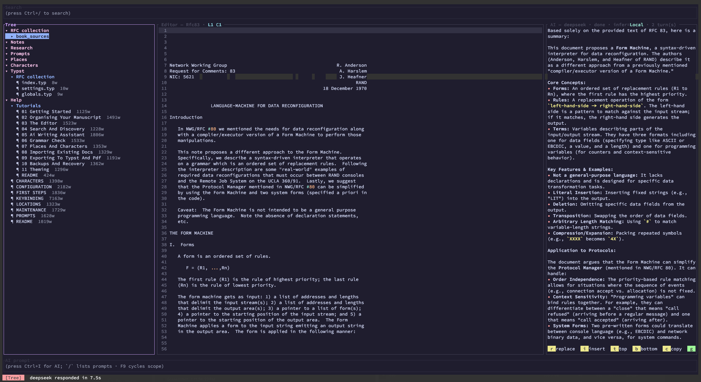

# Inkhaven (blackInkhaven)

**Inkhaven** is a standalone terminal application for writing books and
long-form technical documentation. It pairs a full-screen Typst editor with
a local semantic index, an AI writing assistant, versioned snapshots, and a
backup pipeline — so the entire writing workflow lives inside one binary,
without leaving the terminal.

Your manuscript is organised as a hierarchy of `.typ` files
(Book → Chapter → Subchapter → Paragraph), with first-class
**image** (`.png` / `.jpg` / …), **HJSON data** (`.hjson`), and
**Bund script** (`.bund`) leaves alongside paragraphs. Inkhaven
stores metadata in a local DuckDB database, indexes every text
node for full-text and semantic search, keeps versioned
snapshots, embeds the [Bund](Documentation/Bund/README.md)
scripting language for hooks + custom rules, and streams answers
from your chosen LLM provider — six are bundled (**Gemini**,
**Claude**, **OpenAI**, **DeepSeek**, **Grok**, **Ollama**) and any
model [genai](https://github.com/jeremychone/rust-genai) routes is
one HJSON line away.



## Latest release · 1.2.14 — Plot intelligence + inline comments + quick wins

Read the full notes: [`Documentation/RELEASE_NOTES/1.2.14.md`](Documentation/RELEASE_NOTES/1.2.14.md)

1.2.14's headlines are the new **Threads system
book** (a plot-intelligence workbench that ties
narrative beats to manuscript paragraphs) and
**inline sidecar comments** (margin notes that
travel with the prose in git).  Around them sit
a sweep of authoring quick-wins: 14 init
templates, snippet expansion, AI continuation
drafting, inline footnotes, a project word-count
goal modal, and style-transfer rewrite.

Shipped across 9 planned phases (A.1-A.3, C.1 +
C.1.1 + C.2 + C.2.1, Q.1, Q.2 + Q.2.1, Q.3, Q.4)
plus a 7-step tooling-polish round (D.1-D.7).
Tests 565 → 637 (+72).

### Threads — plot intelligence

A new `Threads` system book sits next to
`Characters` / `Places` / `Artefacts` and holds
named arcs (each thread is a chapter with a
`Meta` paragraph + waypoint paragraphs).
Waypoints link to manuscript paragraphs, so the
project knows which prose advances which arc.

* **`Ctrl+V Shift+H` — threads picker + weave
  view.**  Fuzzy picker over every thread;
  Enter opens a swim-lane weave view of the
  selected thread plus its 4 closest neighbours
  (by waypoint overlap) — manuscript paragraphs
  on the horizontal axis, threads as lanes,
  waypoints as `●`, gaps as `·`.
* **`Ctrl+V Shift+A` — AI thread audit.**
  Streams the configured LLM a structural view
  of every thread + waypoints; asks for blind
  spots (unfired payoffs, dormant arcs, gaps).
* **`Ctrl+V Shift+D` — thread doctor modal.**
  Deterministic version of the AI audit: flags
  zero-links, payoff-unfired, dormant (last
  waypoint > 30 days old).  TUI equivalent of
  `inkhaven thread doctor`.
* **`inkhaven thread` CLI** — `add` / `list` /
  `doctor` / `export --format json|csv|markdown`
  for the scripted side of the workflow.

### Inline comments — margin notes that diff

A `Ctrl+V c` adds an inline comment to the
current selection (or the cursor's word, if no
selection); the body lives in a sidecar
`<paragraph>.comments.json` so it travels with
the prose in git and merges cleanly.  Char-offset
spans (not byte) for UTF-8 safety.  The commented
span renders with `theme.comment_span_modifier`
(default underline + italic); cursor inside the
span surfaces `comment by <author> · <age>: <text>`
in the editor footer.

* **`Ctrl+V Shift+C` — comments panel.**
  Project-wide panel walking every sidecar.
  Columns: breadcrumb / author / age / snippet
  plus a `(N/M in ¶)` dense indicator for
  paragraphs carrying multiple comments.  Panel
  chords: `Enter` open + jump cursor to the span,
  `r` resolve, `R` toggle resolved-filter, `d`
  delete, `/` filter, `a` AI digest (categorises
  comments as STRUCTURAL / PROSE / FACTUAL /
  QUESTION).
* **`inkhaven comments` CLI** — `list` (with
  `--paragraph`, `--resolved`, `--json` filters),
  `resolve` / `reopen` / `delete`, `export
  --format json|csv|markdown`.

### 14 init templates (5 Russian + 3 international new)

`inkhaven init <path> --template <name>`
scaffolds a fresh project from a genre-aware
template.  1.2.14 grows the registry to 14:

* Original 6: `empty`, `novel`, `nonfiction`,
  `rpg-sourcebook`, `technical`, `nanowrimo`
* 5 Russian (Толстой / Пушкин / Стругацкий /
  былины / Чернышевский traditions):
  `russian-novel`, `russian-long-story`,
  `russian-scifi`, `russian-lore`,
  `russian-utopia`
* 3 international: `epic-fantasy` (Tolkien /
  Sanderson — Prologue + 3 Books + Epilogue +
  Appendices with hero / shadow / mentor seeds),
  `mystery` (Christie / Doyle — crime /
  investigation / revelation with detective + 3
  suspects), `french-novel` (Hugo / Flaubert /
  Camus — Première / Deuxième / Troisième partie)

`inkhaven template list` enumerates the full set
with recommended word-count goals.

### Snippet expansion (HJSON-driven)

Snippets configured under the `snippets` block
in `inkhaven.hjson` expand on Space inside the
editor.  Built-in placeholders: `{date}`,
`{time}`, `{datetime}`, `{slug}`, `{book}`,
`{chapter}`, `{author}`, `{cursor}` (the cursor
position after expansion — split-paste).

### AI continuation, footnote, project goal, style transfer

Four targeted authoring helpers:

* **`Ctrl+V d` — AI continuation drafting.**
  LLM continues the open paragraph in the
  author's voice; previous N paragraphs (config:
  `editor.continuation_anchor_count`) anchor the
  voice; the open paragraph's cursor position is
  marked with `[[CURSOR_HERE]]`.  Response
  wrapped in `<<<DRAFT>>>` markers.
* **`Ctrl+V f` — inline footnote.**  Pops a body
  input; inserts `#footnote[<body>]` (Typst,
  default) or `[^id]` + reference line (markdown,
  when `editor.footnote_style = "markdown"`).
* **`Ctrl+V Shift+G` — project word-count goal
  modal.**  Reads `project.word_count_goal` +
  `project.target_date`; projects finish-date
  from the 30-day word delta; renders a progress
  bar + verdict (`✓ Ahead` / `· On track` / `✗
  Behind` / `✓ Complete`).
* **`Ctrl+V y` — style-transfer rewrite.**
  Pops a recent-paragraph picker for the style
  reference; LLM rewrites the open paragraph in
  the reference's voice (sentence length /
  register / distance / rhythm) while preserving
  meaning + entities + facts.

Every prior release lives under
[`Documentation/RELEASE_NOTES/`](Documentation/RELEASE_NOTES/).

## Why Inkhaven

- **Terminal-first.** Inkhaven runs over SSH, in tmux, on a tiling WM — no
  browser, no Electron. The TUI uses [ratatui](https://ratatui.rs/) and
  [tui-textarea](https://github.com/rhysd/tui-textarea).
- **Your manuscript is plain files.** A paragraph lives in a `.typ` file
  on disk; the metadata database tracks hierarchy and search but the prose
  is text — you can read it, diff it, version-control it, and edit it with
  another tool any time.
- **Semantic search out of the box.** Embeddings via fastembed and HNSW are
  computed locally. Search for *"the moment the lighthouse fails"* and find
  the paragraph even if it never uses those exact words.
- **AI is a co-author you steer.** Inferences stream live; you control the
  **scope** (selection / paragraph / subchapter / chapter / book), the
  **mode** (Local-only RAG vs. Full general knowledge), and the
  **destination** (replace, insert, top, bottom, copy, grammar-apply).
  Inkhaven does NOT provide inherent privacy when external providers
  (Gemini / Claude / OpenAI / DeepSeek / Grok) are used — prompts
  travel to their servers under their terms. For privacy, set
  `llm.default_provider: "ollama"` and run a local model; every other
  inkhaven subsystem (RAG embedding, semantic search, snapshot diff)
  is already on-device.
- **Multilingual.** Snowball stemmers and multilingual embeddings make
  Russian, German, French, Spanish, Italian and others first-class. The
  shipped defaults cover English and Russian.
- **Help, characters, places, artefacts, scripts — built in.** Nine
  system books are seeded on every project: `Notes`, `Research`,
  `Prompts`, `Places`, `Characters`, `Artefacts`, `Typst`, `Scripts`,
  `Help`. Mentions of names from the lexicon books light up in the
  editor (cyan / amber / peach / underline). `Ctrl+B P` / `C` / `Y` /
  `G` query each via RAG. `F1` answers questions about Inkhaven itself
  by RAG over `Help`. `Scripts` (added in 1.2) holds `.bund` source
  files auto-loaded into the embedded Bund scripting VM at project
  open — see [`Documentation/Bund/`](Documentation/Bund/README.md).
- **First-class images.** Drop PNG / JPG / WebP / SVG into the tree;
  Book assembly emits the right `wrap_image_*` calls and ships the
  bytes into the typst tree. `Ctrl+B P` inside `#image("…")` opens a
  sibling picker. Enter on an Image row pops a ratatui-image preview
  (kitty / sixel / iterm2 / half-block).
- **From buffer to PDF in two chords.** `Ctrl+B A` assembles your tree
  into a typst-compilable directory; `Ctrl+B B` compiles it; `Ctrl+B O`
  builds and copies the PDF into your shell's cwd as
  `<book>-YYYYDDMM-HHMM.pdf`. Compile failures route the captured
  stderr into a fresh AI chat with a typst-aware system prompt.

## Features at a glance

### Editor
- Typst syntax highlighting via [tree-sitter-typst](https://github.com/uben0/tree-sitter-typst).
- Regex find / replace with same-line current-match highlighting.
- Split-edit with versioned snapshots — see two versions of a paragraph
  side by side, accept either.
- Word-aware navigation and deletion shortcuts.
- Vertical block selection (Alt+arrows) with rectangular copy.
- System-clipboard cut / copy / paste, plus per-doc undo / redo.
- Live "changes since last save" bolding; grammar-correction highlights
  what changed after a `g` apply.

### Tree
- Multi-level folding (`←` / `→` / `Z` / `X`).
- Per-kind row colours (book / chapter / subchapter / paragraph / image)
  + open-paragraph marker.
- Plain-letter shortcuts for add (`B`/`C`/`V`/`A`/`S`/`+`/`P`),
  delete (`D`/`-`), reorder (`U`/`J`).
- **Document status badge** column — one character per row colour-
  coded to the workflow stage (`n` / `1` / `2` / `3` / `F` / `R`).
- Mouse: click to focus + select; scroll wheel scrolls.

### AI pane
- Streaming markdown rendering — bold / italic / headings / code / lists.
- Six **scope modes** (cycled by `F9`): None, Selection, Paragraph,
  Subchapter, Chapter, Book — each prepends the matching content to the
  next prompt.
- Two **inference modes** (`F10`): **Local** (use only supplied context)
  and **Full** (augment with general knowledge). Help inferences are pinned
  to Local automatically.
- Persistent **chat history** with one-key clear (`Ctrl+B C`).
- **Full-screen AI layout** (`Ctrl+B K`) — AI pane + scrollable chat
  history + AI prompt; persisted to `.inkhaven-chat.json` between
  sessions; `Ctrl+F` searches; `Ctrl+C` enters a turn-selection mode.
- **Lexicon RAG** — `Ctrl+B P` / `C` / `G` / `Y` in the editor sweep
  the selection through `Places` / `Characters` / `Notes` / `Artefacts`
  and prepend the lookup to the next AI prompt.
- **F1 Help-manual** floating query → grounded answer over the Help book.
  `inkhaven import-typst-help` seeds Help with a curated typst reference.
- **F7 Grammar check** with deterministic correction extraction (`g`
  replaces the buffer with just the corrected text, preserving Typst
  markup).

### Storage and backup
- DuckDB metadata + Tantivy full-text + HNSW vectors via
  [bdslib](https://github.com/vulogov/bdslib).
- Snapshots: `F5` captures the buffer; `F6` opens the snapshot history
  picker.
- `inkhaven backup --out <dir>` zips the entire project.
- `inkhaven restore <archive> --to <dir>` puts it back.
- Auto-backup on TUI exit when the last backup is older than
  `backup.max_age` (humantime: `7d`, `12h`, `30m`, …) — splash screen with
  a progress bar.
- Session persistence: cursor position, focus, tree-scroll, open paragraph
  all survive restarts. Per-paragraph cursor memory: switch around and
  every paragraph remembers where you were.

### CLI tools
- `init` — set up a fresh project (interactive confirmation if the
  directory exists).
- `add` / `delete` / `mv` / `list` — manage the hierarchy from a script.
- `search "phrase"` — semantic search from the shell.
- `reindex` — re-walk `.typ` files into the database.
- `export typst` / `export pdf` — produce a single Typst manuscript or a
  built PDF.
- `import-help --documents-directory <dir>` — populate the Help book from
  a directory of markdown / text / typst files (wipes Help first).
- `backup` / `restore` — see above.
- `ai "prompt"` — one-shot inference from the shell (no TUI).

### Configuration
A single `inkhaven.hjson` in each project root drives every knob:
embedding model, LLM providers, autosave cadence, sync interval, hierarchy
depth, language, snowball stemmers, the full visual theme (per-pane
backgrounds and foregrounds, all syntax colours, lexicon highlight
colours), key bindings, and backup policy.

## Install

Inkhaven ships as a single static binary per platform. Three install paths:

### 1. `cargo binstall` (no compile)

If you already have [`cargo-binstall`](https://github.com/cargo-bins/cargo-binstall):

```bash
cargo binstall inkhaven
```

`cargo-binstall` reads `[package.metadata.binstall]` from `Cargo.toml`,
picks the right asset off GitHub Releases, and drops the binary into
`~/.cargo/bin`. Works on Linux (x86_64), macOS (Intel + Apple Silicon),
and Windows (x86_64).

### 2. GitHub Releases (direct download)

Grab the tarball for your platform from
[Releases](https://github.com/vulogov/blackInkhaven/releases), unpack,
and put `inkhaven` somewhere on your `PATH`. Builds are produced by
the [`release.yml`](.github/workflows/release.yml) workflow on every
tag push.

### 3. `cargo install inkhaven` (compile from crates.io)

```bash
cargo install inkhaven
```

Inkhaven is published on crates.io — every release tag pushes a
new version (latest: 1.2.14).  The first build takes ~10 minutes on
a modern laptop because of DuckDB + Tantivy + fastembed compilation;
`cargo binstall` above is the fast path.

### 4. `cargo install --git` (compile from a specific tag)

```bash
cargo install --git https://github.com/vulogov/blackInkhaven --tag v1.2.14
```

Useful when you want a specific tag, a pre-release branch, or a
local fork.

## Quick start

```bash
# Build (if installing from source)
cargo build --release

# Initialise a project (asks for confirmation if the directory exists)
./target/release/inkhaven init ~/Books/my-novel

# Build the hierarchy from the CLI…
./target/release/inkhaven --project ~/Books/my-novel add book "My Novel"
./target/release/inkhaven --project ~/Books/my-novel \
    add chapter "The Beginning" --parent my-novel
./target/release/inkhaven --project ~/Books/my-novel \
    add paragraph "Opening Scene" --parent my-novel/the-beginning

# …or skip the CLI and add everything from the TUI
./target/release/inkhaven --project ~/Books/my-novel
# Inside the TUI: B (book), C/V (chapter), A/S (subchapter), +/P (paragraph)
```

## Use cases

- **Long-form fiction.** Hierarchy fits novels naturally (Book → Part →
  Chapter → Scene). Places / Characters / Research system books keep
  worldbuilding next to prose.
- **Technical documentation.** Each chapter is a `.typ` file; the tree
  doubles as a table of contents. Semantic search makes "where did I
  document the retry policy?" a one-keystroke question.
- **Translation work.** Multilingual embeddings + per-language Snowball
  stemmers let you keep source and target in two parallel books.
- **Research notebooks.** Snapshots track how a draft evolved; the AI pane
  can summarise a chapter when you come back after a week.
- **Help and onboarding writing.** Ship docs as a directory and let
  Inkhaven build a Help book your readers can query through F1.

## Documentation

The full docs live under [`Documentation/`](Documentation/).

Start here:

- [`Documentation/README.md`](Documentation/README.md) — entry point and
  table of contents.
- [`Documentation/FIRST_STEPS.md`](Documentation/FIRST_STEPS.md) — compile,
  install, initialise.
- [`Documentation/Tutorials/`](Documentation/Tutorials/) — narrative
  walk-throughs, each focused on one workflow.

Reference:

- [`Documentation/KEYBINDING.md`](Documentation/KEYBINDING.md) — every
  keystroke the TUI recognises, organised by pane and overlay.
- [`Documentation/CONFIGURATION.md`](Documentation/CONFIGURATION.md) —
  the full HJSON reference.
- [`Documentation/MAINTENANCE.md`](Documentation/MAINTENANCE.md) — backup,
  restore, reindex, logs.
- [`Documentation/PROMPTS.md`](Documentation/PROMPTS.md) — the prompt
  library and the Prompts system book.
- [`Documentation/LOCATIONS.md`](Documentation/LOCATIONS.md) — managing
  Places.
- [`Documentation/CHARACTERS.md`](Documentation/CHARACTERS.md) — managing
  Characters.

## Built with

- [bdslib](https://github.com/vulogov/bdslib) — DuckDB + Tantivy +
  fastembed + HNSW document store
- [ratatui](https://ratatui.rs/), [tui-textarea](https://github.com/rhysd/tui-textarea)
- [tree-sitter](https://tree-sitter.github.io/) +
  [tree-sitter-typst](https://github.com/uben0/tree-sitter-typst)
- [genai](https://github.com/jeremychone/rust-genai) — provider-neutral
  LLM streaming
- [pulldown-cmark](https://github.com/raphlinus/pulldown-cmark),
  [rust-stemmers](https://github.com/CurrySoftware/rust-stemmers),
  [zip](https://github.com/zip-rs/zip2),
  [humantime](https://github.com/tailhook/humantime), and many others —
  see [`Cargo.toml`](Cargo.toml).

## Licence

Apache 2.0 — see [`LICENSE`](LICENSE).
